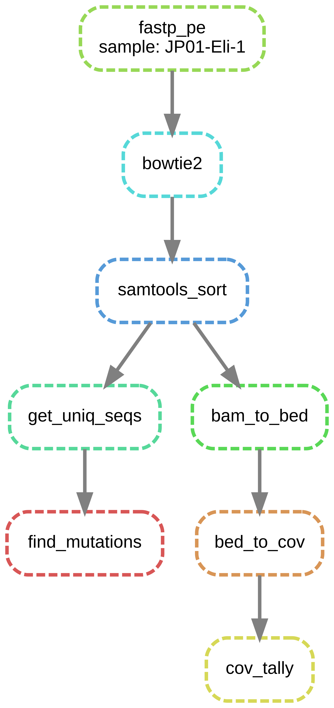

snakeAmpSeq: an adaptable pipline for the detection of target site mutations in *Poa annua*
-----------------------------------------------

snakeAmpSeq is a pipeline designed to take amplicon sequencing results, clean them with fastp,
map them to user defined references, search for target site mutations known or suspected to cause
herbicide resistance. It also checks to see the sequencing coverage over each of the target sites.
Coverage is of target sites is quantified with bedtools, and using a user defined bed.


-----------------------------------------------
# Naming Conventions
The python scripts included rely heavily on naming conventions. These can be modifed 
in the underlying source code if they become too cumbersome, or do not fit your experiment.

## Fastq Files

Fastq files are assumed to be structured as: `left=<uniq_id>_R1_001.fastq.gz`, and 
`<right=<uniq_id>_R2_002.fastq.gz>`. This can be modified in the `Snakefile`, or you could
format your sequecing files using a soft link bash, to create a name that fits current 
`Snakefile` assumptions

## Reference Fasta Files
Fasta header should be formated as follows:
`<gene>_<unique id>` in the case that you do not have homeologs I recommend
just using a consistent dummy variable. The uniq_id should include homeolog indicator
if you wish to separate polyploids loci by subgenomic location. Though the mapping at 
this fine grain with  included bowtie2 settings is only semi-reliable.

## Target Site Bed

Site_name formatting, gene name should be all lowercase, AA should
begin a capital letter and be the represented as the 3 letter abbreviation.
so for `Met not M` and it should end in the AA position. See example below.
```
 example:
      <contig  start stop site_name orient> 
      tua_inf6	519	522	tuaValIlePhe202	+
      tua_inf6	630	633	tuaThr239	+	
      tua_inf6	641	644	tua243Arg	+	
      tua_inf6	717	720	tuaMet268	+	
    
```  
--------------------------------------------------------------------------
# Quick Start

1. Download ampseq files into downloads folder. This will vary based on your sequencing provider. I am providing a mock up, but retrieving sequences will vary with sequencing service provider.
```
$ cd resources/downloads
$ sftp <someUserName>@<some server>
# you are now on the server
$ cd <into dir containing reads>
$ get *.gz
$ <ctrl-d> # to exit sftp
# You are back in resources/downloads
```
2. Check to see if files end  `left=<uniq_id>_R1_001.fastq.gz`, and 
`<right=<uniq_id>_R2_002.fastq.gz>` if not you can use an approach below.
```
$ for r in *<right_id>.fastq.gz 
$ do 
$ new_r=$( echo ${r} | sed s/<right_id.*>/_R2_002.fastq.gz/ )
$ ln -s ${r} ${new_r}
$ done 


$ for l in *<left_id>.fastq.gz 
$ do 
$  new_l=$( echo ${l} | sed s/<left_id.*>/_R1_001.fastq.gz/ )
$  ln -s ${l} ${new_l}
$ done 

```
or you can change the coding in the actual Snakefile.

3. Once the files are in `resources/downloads` and properly labeled. `conda_runner.sh`
will run the snakeAmpSeq pipeline if anaconda3 is in your path.
```

$ cd workflow/scripts
$ ./conda_run.sh

```

